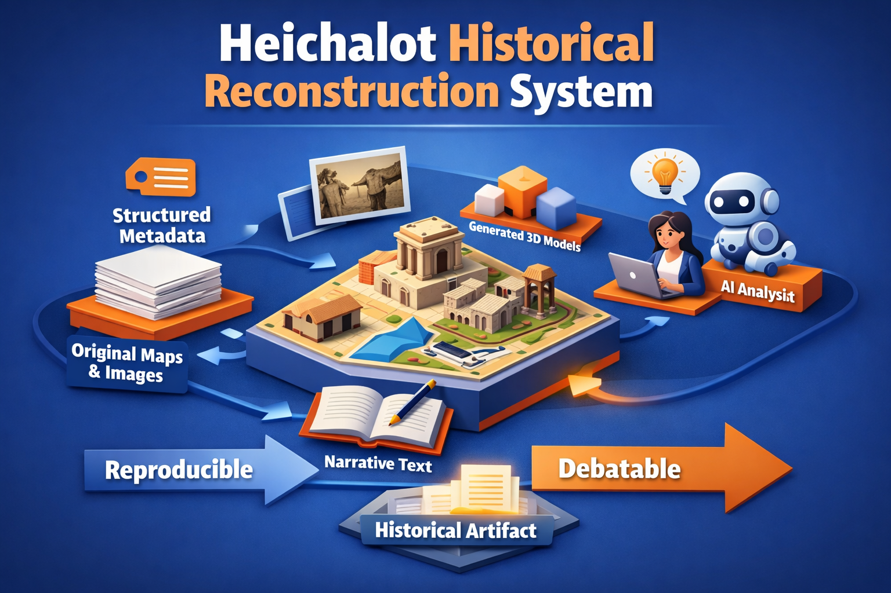

# Heichalot-CMS
A Content-Management-System designed for Remote-Viewing Stories and Diaspora Information



## Introduction

Heichalot CMS is a lightweight framework for recording, searching, and analysing remote-viewing and historical information.

The system allows an **Archivist** to take a historical map, image, or written description of a place and convert it into a reproducible digital reconstruction. These reconstructions can be viewed, compared across time, and debated using both human and AI analysis.

The project originated from a simple question:

> How can historical claims be documented in a way that makes them difficult to distort or falsify later?

Rather than storing historical claims only as text or narrative, the system records them as a combination of:

- structured metadata
- original images and maps
- narrative explanation written by the archivist

Each historical entry becomes a **reproducible historical artifact** rather than only a written argument.

A live instance is available at **[https://heichalot.tech/cms](https://heichalot.tech/cms)**.

---

## Design Philosophy

The system is intentionally simple.

Most historical reconstruction tools are large GIS systems or complex game engines. These systems are powerful but difficult for historians or archivists to use.

Heichalot takes a different approach:

- plain text files (Markdown + YAML frontmatter)
- minimal configuration
- simple Python CLI tools
- optional Blender modeling
- output to PDF, HTML, and video (Remotion)

This allows a reconstruction to be built quickly while still preserving enough structure for later verification.

The project emphasizes **clarity and reproducibility over technical complexity**.

---

## Features

- **Entry management** — create, list, and search CMS entries with structured metadata (location, year, source, tags)
- **PDF rendering** — story to PDF via ReportLab with dialogue, prose, slides, and images
- **HTML rendering** — standalone or fragment HTML output
- **Video rendering** — compile story markdown into video via Remotion (React/TypeScript)
- **Search** — full-text and metadata search across entries
- **LAN AI chat** — MQTT-based controller for local Ollama-powered AI conversations
- **YouTube import** — pull YouTube transcripts into CMS entries
- **AI transcript import** — import terminal AI session transcripts into story format
- **Blender integration** — import base maps and generate 3D scene geometry

---

## Installation

### Prerequisites

- Python 3.10+ and pip
- Node.js 18+ and npm (for video rendering only)
- Optional: Mosquitto MQTT broker (for LAN AI chat)

### Setup

```bash
git clone https://github.com/DavidLyon66/Heichalot-CMS.git
cd Heichalot-CMS
python3 -m pip install -r src/requirements.txt
python3 tools/config.py --setup
```

The config setup will prompt for your CMS content directory (default: `~/Documents/heichalot-cms/cms`).

### Video rendering (optional)

```bash
cd videorender
npm install
```

---

## Usage

```bash
# Open the GUI
python3 src/heichalot-cms.py
```

---

## Project Structure

```
Heichalot-CMS/
  tools/              # Python CLI tools (package)
  tests/              # pytest test suite
  videorender/        # Remotion video rendering project
  sphinx/             # Documentation
  images/             # Project assets
  cms/                # (optional) local sample entries
```

CMS content is stored separately — configured at setup time (default `~/Documents/heichalot-cms/cms`).

---

## License

MIT
